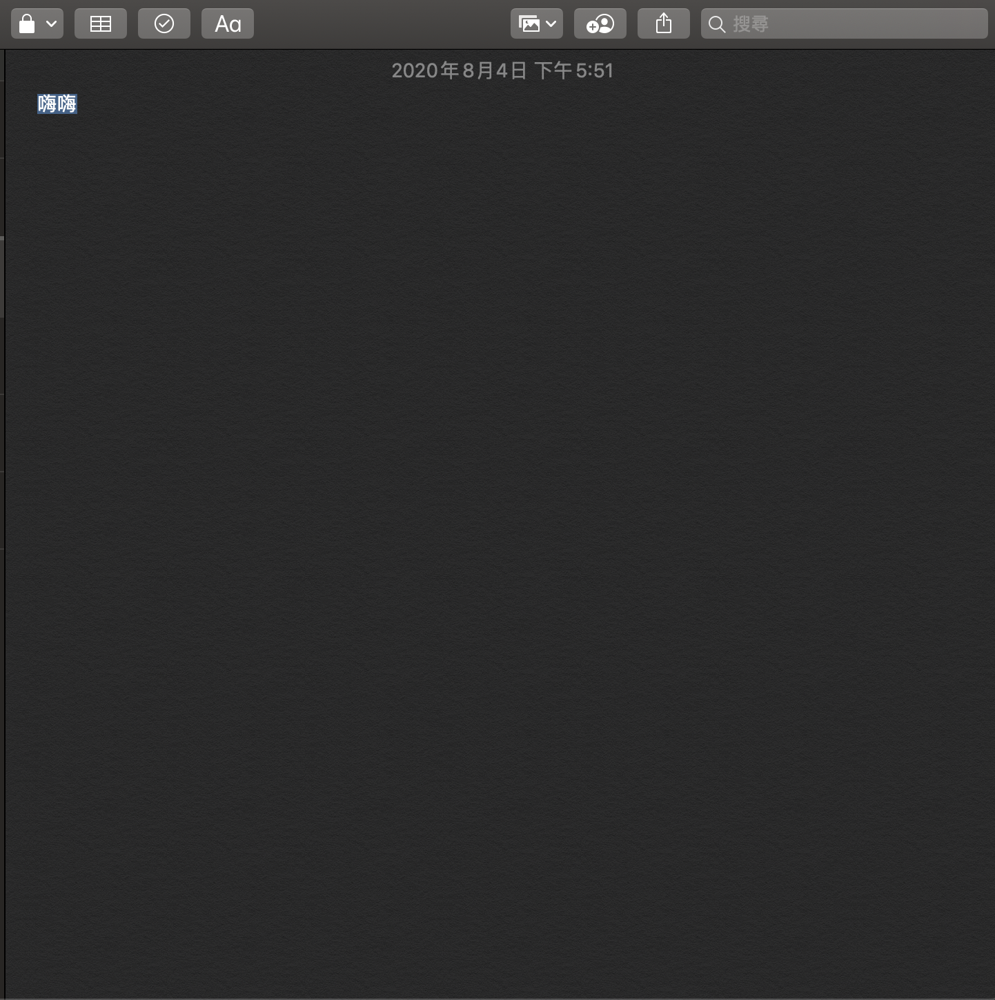
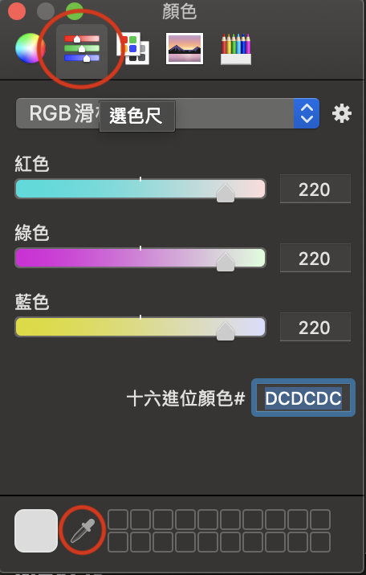

## MacOS偷懶法
<!-- TOC -->

- [MacOS偷懶法](#macos%E5%81%B7%E6%87%B6%E6%B3%95)
    - [序言](#%E5%BA%8F%E8%A8%80)
    - [常用快捷鍵](#%E5%B8%B8%E7%94%A8%E5%BF%AB%E6%8D%B7%E9%8D%B5)
    - [MacOS獨特功能](#macos%E7%8D%A8%E7%89%B9%E5%8A%9F%E8%83%BD)
    - [終端機應用](#%E7%B5%82%E7%AB%AF%E6%A9%9F%E6%87%89%E7%94%A8)
    - [抓色碼](#%E6%8A%93%E8%89%B2%E7%A2%BC)
    - [推薦軟體](#%E6%8E%A8%E8%96%A6%E8%BB%9F%E9%AB%94)

<!-- /TOC -->

### 序言
身為Mac愛好者的我，應該也入坑3年有了，走了很多的路，玩了很多的功能。  
想說趁這個機會來跟大家分享一下，尤其自己又是一個很怕麻煩，最喜歡能簡就簡，能懶就懶的定律~  
~~所謂的簡約生活~~

### 常用快捷鍵
1) 全螢幕：<kbd>control</kbd>+<kbd>command</kbd>+<kbd>F</kbd>
2) 快速替看檔案/資料夾：在檔案/資料夾點一下後，按<kbd>空白鍵</kbd>
3) Samba(類Windows的網路芳鄰)：回到桌面點選一下，或點Finder，<kbd>command</kbd>+<kbd>K</kbd>。即可輸入IP(像是NAS)，就可連接上。
4) 增加桌面：任何地方四指在軌跡板上往上滑，滑鼠移動右上角，按下加號，即產生。
5) 強制結束應用程式：<kbd>option</kbd>+<kbd>command</kbd>+<kbd>esc</kbd>
6) 前往資料夾：處在Finder的程式時，按下<kbd>shift</kbd>+<kbd>command</kbd>+<kbd>G</kbd>
7) 螢幕截圖/錄影：
    - 全螢幕截圖：<kbd>shift</kbd>+<kbd>command</kbd>+<kbd>3</kbd>
    - 選擇區域截圖：<kbd>shift</kbd>+<kbd>command</kbd>+<kbd>4</kbd>
    - 螢幕錄影：<kbd>shift</kbd>+<kbd>command</kbd>+<kbd>5</kbd>

[⬆️Top](#MacOS偷懶法)

---

### MacOS獨特功能
    1) 預覽程式
    2) 隨處皆可列印(cmd+p) => 輸出成pdf、png等…
    3) 螢幕錄影、截圖

[⬆️Top](#MacOS偷懶法)

---

### 終端機應用
    1) iTerm2 - cmd+R => 快速清理
    2) shell script
    3) link

[⬆️Top](#MacOS偷懶法)

---

### 抓色碼
有時寫網頁，或設計圖像時，會需要準確的知道某一物品等其色碼為多少，使用MacOS內建的**備忘錄**，即可取得。  
方法如下：  
1) 打開備忘錄，隨意新增一則新的文章，隨意輸入一個字以上即可，將其反白。  

2) 按下組合鍵：<kbd>shift</kbd>+<kbd>command</kbd>+<kbd>C</kbd>。呼叫出「顏色設定」。

3) 選擇上排圈起來的第二個「選色尺」，再點選下方圈起來的「滴管」。
4) 使用滴管開始找尋需要的顏色去點選，再回到「選色尺」，查看「十六進位顏色」，即可找到其色碼。

[⬆️Top](#MacOS偷懶法)

---

### 推薦軟體
- [限時情報王(iOS軟體)](https://apps.apple.com/tw/app/限時情報王/id1119596304)
- [Telegram](https://telegram.org)
- [iTerm2](https://www.iterm2.com)
- [Keka](https://www.keka.io/zh-tw/)
- [Color Folder](https://apps.apple.com/tw/app/color-folder-master-%E6%AA%94%E6%A1%88%E5%A4%BE%E9%A1%8F%E8%89%B2%E4%B8%80%E9%8D%B5%E6%9B%B4%E6%94%B9/id1450345160?mt=12)
- [AppCleaner](https://freemacsoft.net/appcleaner/)
- [Visual Studio Code](https://code.visualstudio.com)
- [VLC](https://www.videolan.org/vlc/index.zh-TW.html)

[⬆️Top](#MacOS偷懶法)

---